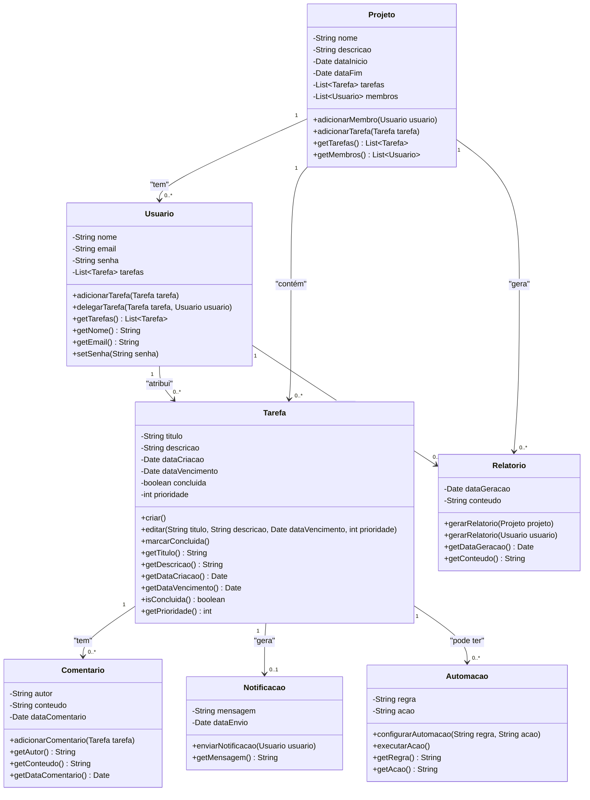

# gerenciador-tarefas

```mermaid
classDiagram
    class Tarefa {
        -String titulo
        -String descricao
        -Date dataCriacao
        -Date dataVencimento
        -boolean concluida
        -int prioridade
        +criar()
        +editar(String titulo, String descricao, Date dataVencimento, int prioridade)
        +marcarConcluida()
        +getTitulo() String
        +getDescricao() String
        +getDataCriacao() Date
        +getDataVencimento() Date
        +isConcluida() boolean
        +getPrioridade() int
    }

    class Usuario {
        -String nome
        -String email
        -String senha
        -List~Tarefa~ tarefas
        +adicionarTarefa(Tarefa tarefa)
        +delegarTarefa(Tarefa tarefa, Usuario usuario)
        +getTarefas() List~Tarefa~
        +getNome() String
        +getEmail() String
        +setSenha(String senha)
    }

    class Projeto {
        -String nome
        -String descricao
        -Date dataInicio
        -Date dataFim
        -List~Tarefa~ tarefas
        -List~Usuario~ membros
        +adicionarMembro(Usuario usuario)
        +adicionarTarefa(Tarefa tarefa)
        +getTarefas() List~Tarefa~
        +getMembros() List~Usuario~
    }

    class Notificacao {
        -String mensagem
        -Date dataEnvio
        +enviarNotificacao(Usuario usuario)
        +getMensagem() String
    }

    class Comentario {
        -String autor
        -String conteudo
        -Date dataComentario
        +adicionarComentario(Tarefa tarefa)
        +getAutor() String
        +getConteudo() String
        +getDataComentario() Date
    }

    class Relatorio {
        -Date dataGeracao
        -String conteudo
        +gerarRelatorio(Projeto projeto)
        +gerarRelatorio(Usuario usuario)
        +getDataGeracao() Date
        +getConteudo() String
    }

    class Automacao {
        -String regra
        -String acao
        +configurarAutomacao(String regra, String acao)
        +executarAcao()
        +getRegra() String
        +getAcao() String
    }

    Usuario "1" --> "0..*" Tarefa : "atribui"
    Projeto "1" --> "0..*" Usuario : "tem"
    Projeto "1" --> "0..*" Tarefa : "contém"
    Tarefa "1" --> "0..*" Comentario : "tem"
    Tarefa "1" --> "0..1" Notificacao : "gera"
    Tarefa "1" --> "0..*" Automacao : "pode ter"
    Usuario "1" --> "0..*" Relatorio : "gera"
    Projeto "1" --> "0..*" Relatorio : "gera"
```
